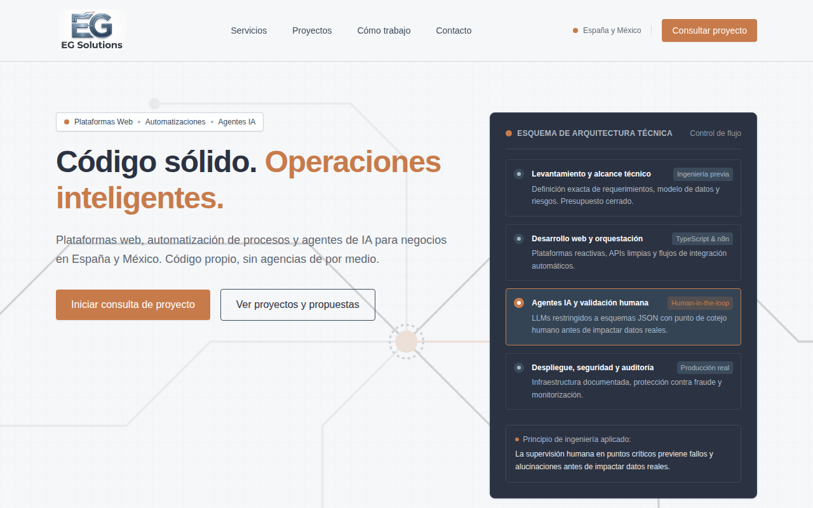
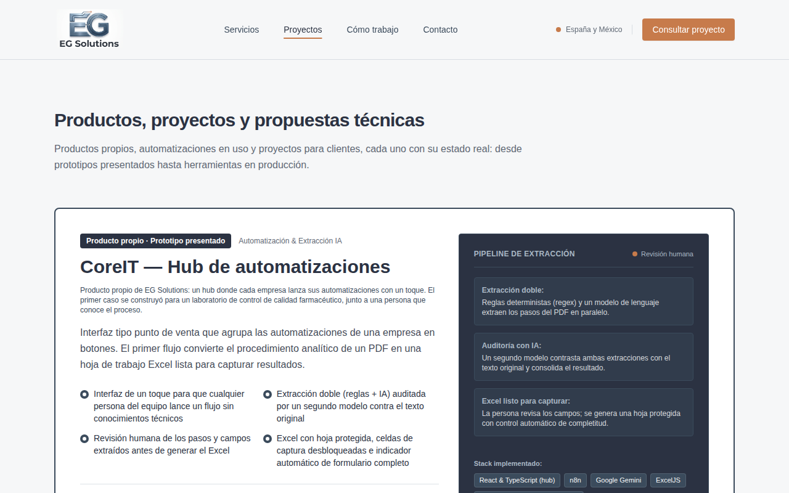

# EG Solutions — web y captación de leads

Web de [EG Solutions](https://egsolutions.tech): plataformas web, automatizaciones y agentes de IA para negocios en España y México. Además de la web, incluye el backend que recibe los formularios, los clasifica con IA y hace el seguimiento.



## Qué hace

- **Web multipágina.** La portada resume cada sección y enlaza a su página: `/servicios`, `/proyectos`, `/como-trabajo` y `/contacto`. Usa un router propio con la History API (`src/router.ts`), sin dependencias.
- **Proyectos generados desde una fuente única.** `src/data/projects.json` no se edita a mano: lo genera el repo de contenidos con `scripts/build-webs.mjs --eg`.
- **Pipeline de leads serverless** (`api/lead.ts`):
  1. Honeypot antibots y validación.
  2. Clasificación con Gemini en JSON estructurado: urgencia, coherencia con la categoría y resumen. Si falla, usa una clasificación por defecto.
  3. Guarda el lead en Firestore.
  4. Envía en paralelo el aviso interno y la confirmación al cliente (nodemailer).
- **Seguimiento automático:** un cron diario de Vercel (`api/follow-up-check.ts`, protegido con `CRON_SECRET`) avisa de los leads que llevan más de 48 h sin respuesta.
- **Contacto por WhatsApp** y política de privacidad en un modal.



## Stack

React 19 · TypeScript · Vite · Tailwind CSS 4 · Vercel (funciones serverless, cron y Analytics) · Gemini API · Firebase Admin (Firestore) · Nodemailer

## Estructura

```
api/                 Funciones serverless (lead, follow-up-check) y librerías compartidas
src/router.ts        Páginas y navegación
src/components/      Secciones de la web (Hero, HomePreviews, Services, CaseStudies…)
src/data/            Servicios, pasos del método y proyectos (generados)
vercel.json          Cron diario y rewrite SPA
```

## Desarrollo

```bash
npm install
cp .env.example .env   # rellena las variables
npm run dev            # http://localhost:3000
npm run lint           # comprobación de tipos
```

Las variables necesarias están documentadas en `.env.example`: Gemini, Firebase Admin, Gmail, email de aviso y `CRON_SECRET`.
